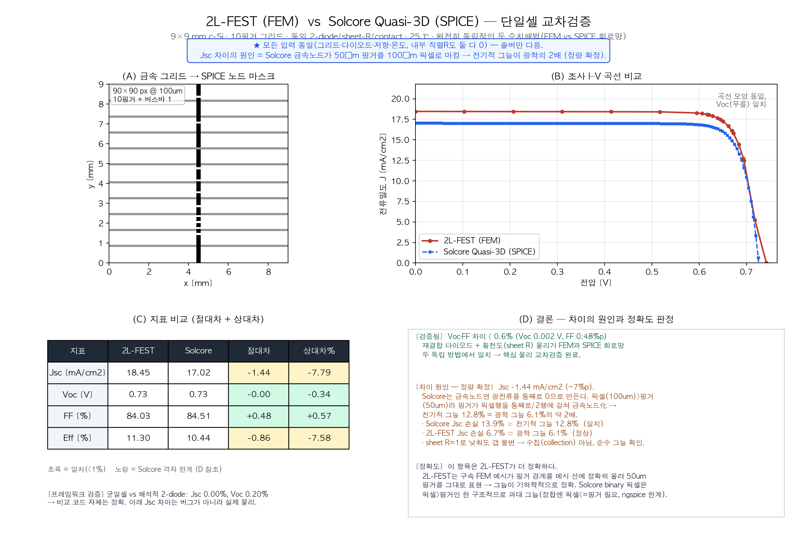

# GEDOS (FEM) vs Solcore Quasi-3D (SPICE) — 단일셀 교차검증 보고

> 위 그림 한 장에 전체 내용이 담겨 있습니다. 아래 설명은 그림의 패널 (A)~(D)를 차례로 따라갑니다.

---

## 🇰🇷 한국어

### 한 줄 요약 (그림 상단 파란 배너)
모든 입력(그리드·다이오드·저항·온도)을 **똑같이** 맞추고 **푸는 방법(솔버)만** 다르게 돌렸습니다.
→ **Voc·FF는 일치**(핵심 물리 검증), **Jsc 차이는 Solcore 격자가 가는 핑거를 굵게 그려 그늘을 2배로 친 것**일 뿐입니다.

### 왜 했나
박사님 지시로, Solcore의 Quasi-3D 솔버를 참고·비교했습니다. 목적은 **완전히 독립적인 제3의 솔버로 GEDOS 결과를 교차검증**하는 것입니다.

두 프로그램은 같은 태양전지를 **다른 수학으로** 풉니다:
- **GEDOS (우리 것)** = 셀을 **삼각형 그물망(FEM)** 으로 잘게 나눠 품. 핑거·버스바 경계를 그물망 선에 정확히 올려 전극 모양을 **있는 그대로** 표현.
- **Solcore** = 셀을 **바둑판(정사각 픽셀)** 으로 나누고 각 칸을 회로 부품으로 바꿔 **SPICE 회로 시뮬레이터(ngspice)** 로 품.

### (A) 금속 그리드 → SPICE 노드 마스크
GEDOS의 실제 핑거 10개 + 버스바를, Solcore가 풀 수 있도록 **90×90 바둑판(픽셀 100µm)** 으로 옮긴 그림입니다. 검은 줄이 금속(핑거/버스바)입니다.

### (B) I–V 곡선 비교
빨강(GEDOS)과 파랑(Solcore) 두 곡선이 **거의 같은 모양**이고 **무릎(Voc) 위치도 일치**합니다. 다만 파랑이 전류 축에서 약간 아래로 평행하게 깔립니다(= Jsc 차이).

### (C) 지표 비교표 (절대차 + 상대차)
| 지표 | GEDOS | Solcore | 차이 |
|---|---|---|---|
| **Voc** | 0.728 V | 0.726 V | **−0.002 V (−0.3%)** ✅ |
| **FF** | 84.0% | 84.5% | **+0.5%p (+0.6%)** ✅ |
| Jsc | 18.46 | 17.02 mA/cm² | −1.44 (−7.8%) |
| Eff | 11.30% | 10.44% | −0.86%p (−7.6%) |

표 아래 **"프레임워크 검증"**: 그리드 없는 균일 셀로 돌리면 Jsc가 **0.00%**, Voc 0.20%로 완벽히 일치합니다. → **비교 틀(단위 변환 등) 자체는 정확**하다는 뜻이고, 따라서 아래 Jsc 차이는 코드 버그가 아니라 **실제 물리적 원인**입니다.

### (D) 결론 — 차이의 원인과 정확도 판정
- **[검증됨] Voc·FF 차이 < 0.6%** — 재결합 다이오드 + 횡방향 면저항 수집 물리가 FEM과 SPICE 두 독립 방법에서 일치 → **GEDOS 핵심 물리 교차검증 완료.**
- **[차이 원인 — 정량 확정] Jsc −1.44 mA/cm²:**
  Solcore는 한 칸이 금속이면 그 칸의 전류를 **통째로 0**으로 만듭니다. 그런데 칸(100µm)이 핑거(50µm)보다 굵어서, 50µm 핑거가 칸 하나를 통째로(또는 두 칸에 걸쳐) 금속으로 칠해집니다. 그 결과:
  - **전기적 그늘 12.8% = 실제(광학) 그늘 6.1%의 약 2배**
  - Solcore Jsc 손실 13.9% ≈ 전기적 그늘 12.8% (일치)
  - GEDOS Jsc 손실 6.7% ≈ 광학 그늘 6.1% (정상)
  - **면저항을 55→1로 낮춰도 차이 그대로** → 전류 수집 문제 아님, **순수 그늘 문제** 확인
- **[정확도] 이 항목은 GEDOS가 더 정확합니다.** FEM 그물망이 핑거 경계를 정확히 올려 50µm 핑거를 그대로 표현하므로 그늘이 기하학적으로 정확합니다. Solcore의 바둑판 방식은 칸이 핑거보다 굵은 한 구조적으로 그늘을 과대평가합니다(정합하려면 칸 ≤ 핑거 50µm 필요한데 회로가 너무 커져 ngspice가 수렴 못 함).

### 우리에게 주는 의미
1. **핵심 물리(Voc·FF)가 공개 표준 솔버와 0.5% 내로 교차검증됨** → GEDOS 신뢰성 확인.
2. **Jsc 차이는 Solcore의 격자 한계**이며, 전극(그리드) 해상에서는 **GEDOS의 FEM이 더 정확**함을 정량적으로 보여줌.

---

## 🇬🇧 English

### One-line summary (blue banner at top)
All inputs (grid, diode, resistances, temperature) were made **identical** — only the **solver method** differs.
→ **Voc and FF agree** (core physics validated); the **Jsc difference is purely because Solcore's pixel grid renders the thin finger too wide, doubling the shading.**

### Purpose
At Dr. Kim's request, we benchmarked against Solcore's Quasi-3D solver to **cross-validate GEDOS with a fully independent third solver**.

The two tools solve the same cell with **different mathematics**:
- **GEDOS (ours)** — a **constrained finite-element (FEM) triangular mesh**; finger/busbar edges lie exactly on mesh lines, so the electrode geometry is represented **as-is**.
- **Solcore** — a **regular square-pixel grid**; each pixel becomes a circuit element solved by the **SPICE engine (ngspice)**.

### (A) Metal grid → SPICE node mask
GEDOS's actual 10 fingers + busbar, rasterized onto a **90×90 grid (100 µm pixels)** so Solcore can solve it. Black lines are metal.

### (B) Illuminated I–V overlay
Red (GEDOS) and blue (Solcore) have **the same curve shape** and a **coincident knee (Voc)**; blue sits slightly below in current (the Jsc difference).

### (C) Metric table (absolute + relative)
| Metric | GEDOS | Solcore | Difference |
|---|---|---|---|
| **Voc** | 0.728 V | 0.726 V | **−0.002 V (−0.3%)** ✅ |
| **FF** | 84.0% | 84.5% | **+0.5%p (+0.6%)** ✅ |
| Jsc | 18.46 | 17.02 mA/cm² | −1.44 (−7.8%) |
| Eff | 11.30% | 10.44% | −0.86%p (−7.6%) |

The **"framework check"** note: on a uniform cell (no grid), the two match to **Jsc 0.00%, Voc 0.20%**. This proves the comparison framework (unit conversions, etc.) is sound — so the Jsc gap below is a **real physical effect, not a bug**.

### (D) Conclusion — cause of the gap and which solver is more accurate
- **[Validated] Voc & FF agree to < 0.6%** — recombination-diode + lateral sheet-resistance collection physics match across the FEM and SPICE solvers → **GEDOS's core physics is cross-validated.**
- **[Cause of the gap — quantified] Jsc −1.44 mA/cm²:**
  Solcore zeros the photocurrent on any metal pixel. Because the pixel (100 µm) is wider than the finger (50 µm), each finger fills a full pixel (or straddles two), so:
  - **electrical shading 12.8% = ~2× the true (optical) shading 6.1%**
  - Solcore Jsc loss 13.9% ≈ electrical shading 12.8% (matches)
  - GEDOS Jsc loss 6.7% ≈ optical shading 6.1% (correct)
  - **lowering sheet R from 55→1 leaves the gap unchanged** → not a collection effect, confirmed pure shading
- **[Accuracy] GEDOS is the more accurate one here.** Its FEM mesh resolves the 50 µm finger exactly, so shading is geometrically correct. Solcore's pixel grid structurally over-shades whenever the pixel is coarser than the finger (matching would require pixel ≤ 50 µm, which the SPICE network can no longer converge).

### Take-away
1. **Core physics (Voc, FF) cross-validated to < 0.6% against a public standard solver** → confirms GEDOS's reliability.
2. The **Jsc gap is a Solcore grid limitation**; for electrode/grid resolution, **GEDOS's FEM is quantitatively the more faithful method.**

---
*Files: `solcore_xval/` — compare.py, xval_common.py, drive_gedos.py, calibrate_units.py, make_report_figure.py. Figure: GEDOS_vs_Solcore_quasi3D.png.*
