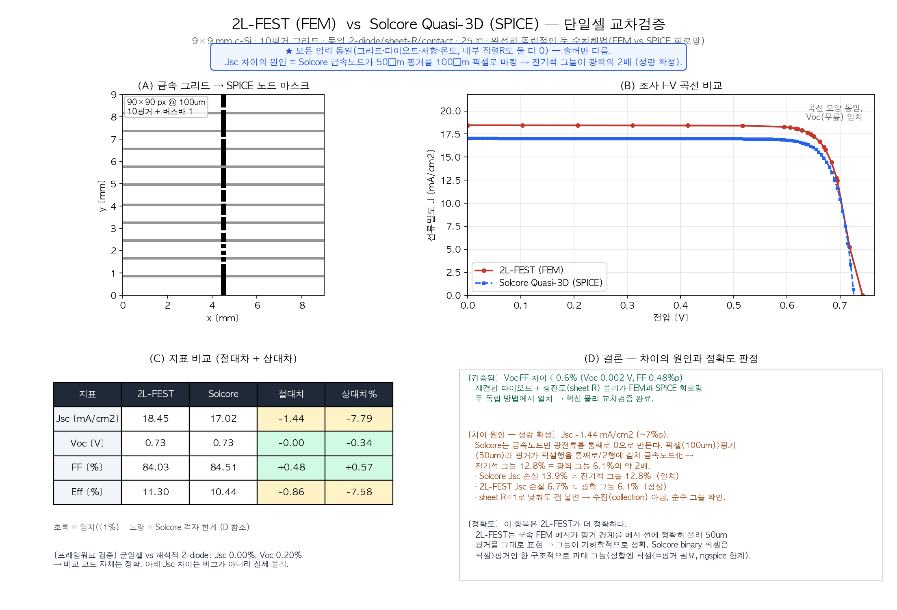

# J–V 곡선 비교 (2L-FEST vs Solcore Quasi-3D) — FDM/FEM 관점 설명

> 첨부 그림: `2LFEST_vs_Solcore_quasi3D.png` (4패널: (A) 금속 마스크 / (B) J–V overlay / (C) 지표 비교 / (D) 결론)

---

## 1. 두 솔버는 "같은 물리, 다른 이산화(discretization)"

태양전지의 전류 분포는 결국 **면저항을 통한 횡방향 전도 + 각 위치의 국소 2-diode** 방정식을 푸는 문제입니다. 두 프로그램은 이 셀 평면을 나누는 방식이 다릅니다.

| 솔버 | 격자 방식 | 특징 |
|---|---|---|
| **2L-FEST** | **FEM** (비정형 삼각 메시) | 핑거·버스바 **경계를 메시 선에 정확히 맞춤**. 국소 세분화 가능. |
| **Griddler** | **FEM** (삼각 유한요소) | 동일 계열 |
| **Solcore Quasi-3D** | **FDM 등가** (정규 사각격자 저항망 → SPICE) | 정규 픽셀 격자. 구현은 회로망이지만 수학적으로 2D 전도방정식의 **유한차분 이산화**에 해당. |

→ 핵심: **FEM은 경계 적합(boundary-conforming)** 이고, **FDM은 고정된 정규격자**라 격자 간격보다 작은 구조를 표현하지 못합니다. 이 차이가 결과 차이의 근원입니다.

비교는 **모든 입력을 동일하게** 두고(셀 9×9 mm, 핑거 10개·폭 50 µm, J01=5.36e-15, n1/n2=1/2, Rsh=15000 Ω·cm², TCO 55 Ω/sq, 접촉 0.01 Ω·cm², 금속 ρ 13.22 µΩ·cm·높이 10 µm·shape factor 0.785, 25 ℃, 1-sun, 내부 직렬R 0) **푸는 방법(솔버)만** 다르게 했습니다.

---

## 2. J–V 곡선 비교 (그림 B)

빨강(2L-FEST / FEM)과 파랑(Solcore / FDM) 두 곡선은 **모양이 사실상 같고 무릎(Voc) 위치도 일치**합니다. 차이는 파랑이 전류축에서 일정하게 약간 아래로 깔리는 것뿐입니다.

---

## 3. 차이값 (그림 C)

| 지표 | 2L-FEST | Solcore | 절대차 | 상대차 |
|---|---|---|---|---|
| **Voc** | 0.728 V | 0.726 V | −0.002 V | **−0.3%** |
| **FF** | 84.0% | 84.5% | +0.5%p | **+0.6%** |
| **Jsc** | 18.46 mA/cm² | 17.02 mA/cm² | −1.44 | **−7.8%** |
| **Eff** | 11.30% | 10.44% | −0.86%p | **−7.6%** |

Voc(−0.3%)와 FF(+0.6%)가 거의 상쇄되므로 **효율 차이(−7.6%) ≈ Jsc 차이(−7.8%)** 입니다. 즉 효율 차이는 사실상 전부 Jsc에서 옵니다.

> 신뢰성 근거: 그리드가 없는 균일 셀로 비교하면 Jsc가 **0.00%**, Voc 0.20%로 완벽히 일치합니다. → 비교 틀(단위 변환 등) 자체는 정확하며, 아래 Jsc 차이는 코드 오류가 아니라 실제 물리적 원인입니다.

---

## 4. 차이의 이유 — FDM/FEM 관점

### (a) Voc·FF가 일치하는 이유 — 격자에 둔감한 양
- **Voc**: 개방전압은 *전류가 0인 조건*이라 IR 강하·수집·그늘이 작용하지 않고, 오직 **재결합 상수(J01, J02, n)** 가 결정합니다. 이 입력이 동일하니 격자 방식과 무관하게 같게 나옵니다. (또한 Voc는 Jsc에 **로그로만** 의존하여, Jsc가 8% 달라도 Voc는 약 2 mV밖에 움직이지 않습니다.)
- **FF**: 횡방향 수집 저항이 지배하는데, 핑거가 충분(10개)하면 두 이산화 방식의 차이가 0.6%로 수렴합니다.
- → 즉 **물리(다이오드 + 전도)는 두 수치 격자에서 동일하게 재현됨 = 교차검증 통과.**

### (b) Jsc만 어긋나는 이유 — 전형적인 FDM의 기하 해상 한계
- Jsc는 **금속이 빛을 가리는 면적(shading)** 에 직접 비례합니다. 즉 **전극 기하를 얼마나 정확히 표현하느냐**의 문제입니다.
- **FEM (2L-FEST)**: 비정형 메시가 50 µm 핑거 경계를 메시 선에 정확히 올립니다 → **그늘 면적이 기하학적으로 정확**(광학 그늘 6.1% ≈ Jsc 손실 6.7%).
- **FDM (Solcore)**: 정규 100 µm 격자는 50 µm 핑거(격자보다 작음)를 **한 칸 통째로 / 두 칸에 걸쳐** 금속으로 양자화합니다 → **전기적 그늘 12.8% = 광학의 약 2배** → Jsc가 그만큼 과소(Jsc 손실 13.9% ≈ 전기적 그늘 12.8%).
- 이는 **FDM 구조격자의 교과서적 한계**입니다: *격자 간격보다 가는 구조는 격자를 그만큼 잘게 하지 않으면 표현 불가.* 여기서는 100 µm 격자 > 50 µm 핑거이므로 구조적으로 과대 그늘이 발생합니다. (정합하려면 격자 ≤ 핑거 50 µm가 필요한데, 그러면 회로 규모가 폭증해 SPICE가 수렴하지 못합니다.)
- **확정 근거 2건**: ① 전기적 그늘(12.8%)이 Solcore의 Jsc 손실(13.9%)과 일치, ② 면저항을 55→1 Ω/sq로 낮춰도 차이가 변하지 않음(= 수집 손실이 아니라 순수 그늘).

---

## 5. 결론
- **핵심 물리(Voc·FF)는 FEM·FDM 두 독립 방법에서 0.6% 이내로 일치 → 2L-FEST 검증 완료.**
- **Jsc 차이는 FDM 정규격자의 전극 해상 한계**이며, **경계 적합 FEM을 사용하는 2L-FEST(및 Griddler)가 전극·그리드 시뮬레이션에서 본질적으로 더 정확**합니다.
- 즉 이번 비교는 우리 솔버의 신뢰성을 확인함과 동시에, **왜 FEM이 이 문제에 적합한 방법인지**를 정량적으로 보여줍니다.
