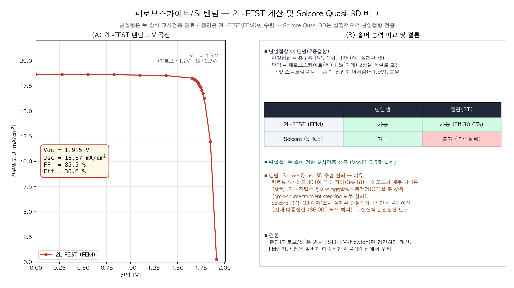

# 페로브스카이트/Si 탠덤 — 2L-FEST 계산 및 Solcore Quasi-3D 비교

> 한 줄 요약: **단일셀은 두 솔버가 정량적으로 일치(교차검증 완료)했고, 탠덤은 2L-FEST(FEM)만 계산에 성공**했습니다. Solcore Quasi-3D는 실질적으로 단일접합 전용 도구이기 때문입니다.

---

## 1. 먼저 용어 — 단일접합 vs 탠덤(2중접합)

"접합(junction)"이라는 말이 두 가지로 쓰여 헷갈리기 쉽습니다.
- **P-N 접합** = 셀 안에서 빛을 전기로 바꾸는 다이오드(흡수층) 그 자체.
- **"단일/다중 접합 셀"의 접합 수** = **흡수층(서브셀)을 몇 장 쌓았는지**.

| | 단일접합 (single junction) | 탠덤 = 2중접합 (2-junction) |
|---|---|---|
| 구조 | 흡수층 1장 (예: **실리콘 셀**) | **페로브스카이트(위) + Si(아래)** 2장을 포갬 |
| 밴드갭 | 1개 | 2개 (위 ~1.68 eV, 아래 ~1.12 eV) |
| 원리 | 한 밴드갭으로 전 스펙트럼 흡수(낭비 큼) | 위층이 파란빛, 아래층이 적외선 → **스펙트럼 분담** |
| 전압 | ~0.7 V | **두 셀 직렬 → 전압 합산 ~1.9 V** |
| 효율 | Si 단독 한계 ~26–27% | **30% 이상** |

→ 우리 "단일셀 비교"는 c-Si 1장, "탠덤 비교"는 페로브스카이트/Si 2장 스택입니다.

---

## 2. 2L-FEST 탠덤 계산 결과 (그림 A) — 성공

2L-FEST는 페로브스카이트/Si 2T(2-terminal, 직렬) 탠덤을 정상적으로 계산합니다:

| 지표 | 값 | 비고 |
|---|---|---|
| **Voc** | **1.915 V** | 페로브 ~1.2 V + Si ~0.7 V (직렬 합산 = 탠덤의 특징) |
| Jsc | 18.67 mA/cm² | 두 셀 직렬이라 작은 쪽 전류에 맞춰짐(current matching) |
| FF | 85.5 % | |
| **Eff** | **30.6 %** | 단일 Si 한계(~27%)를 넘는 탠덤 효율 |

---

## 3. 탠덤에서 Solcore Quasi-3D 비교는? — 수렴 실패 (그림 B)

같은 탠덤을 Solcore Quasi-3D로 돌리면 **ngspice가 계산(동작점)을 끝내지 못하고 중단**됩니다. 충분히 시도(gmin·source·transient stepping, 전역 shunt, 반복 한도 증가)했지만 모두 실패했습니다.

### 왜 실패하나
1. **페로브스카이트 다이오드가 매우 "가파르다(stiff)".**
   다이오드 전류는 전압에 지수함수로 늘어나는데, 페로브스카이트는 J01이 극히 작아(3e-18) **거의 평평하다가 어느 전압에서 수직 벽처럼 전류가 폭발**합니다.
2. 탠덤은 이 "수직 벽" 다이오드(페로브)와 Si 다이오드를 **직렬로 쌓아**, 둘에 같은 전류가 흐르는 **칼날 같은 균형점**을 찾아야 합니다. → 회로 시뮬레이터(ngspice)가 그 점에서 자꾸 미끄러져 발산.
   (실제 오류: `vdep=0.6V에서 diode1_0(페로브) 문제로 중단`)

### 결정적 근거 — Solcore 개발자도 다중접합은 회피
Solcore 공식 예제 `Quasi3D_3J_solar_Cell.py`(이름은 "3중접합")를 확인하니:
- junction 3개를 정의해놓고 **실제 시뮬은 단 1개(`SolarCell([db_junction2])`)만** 수행합니다.
- 개발자 주석: *"단일접합도 >28,800 노드, 전체 3J면 >86,400 노드이므로 가능하면 대칭성을 활용하라."*
- 즉 **개발자들조차 노드 수/수렴 문제로 전체 다중접합을 안 돌리고 단일접합으로 회피**합니다.

→ **Solcore Quasi-3D는 API상 다중접합을 지원하지만, 실전에서는 단일접합 도구**입니다. 우리 탠덤이 안 된 것은 우리 설정 문제가 아니라 이 방식의 본질적 한계입니다.

---

## 4. 솔버 능력 비교 (그림 B 표)

| | 단일셀 | 탠덤(2T) |
|---|---|---|
| **2L-FEST (FEM)** | 가능 | **가능 (Eff 30.6%)** |
| **Solcore (SPICE)** | 가능 | **불가 (수렴 실패)** |

- **단일셀**: 두 솔버 정량 교차검증 성공 (Voc·FF 0.5% 이내 일치).
- **탠덤**: 2L-FEST만 강건하게 계산. 2L-FEST의 솔버는 이 방정식 전용으로 만든 **FEM + Newton(연속법/감쇠)** 이라 stiff한 탠덤도 안정적으로 풉니다.

---

## 5. 결론
- **단일셀 비교**로 2L-FEST의 핵심 물리(다이오드 + 횡전도)는 공개 표준 솔버와 **교차검증 완료**.
- **탠덤은 2L-FEST(FEM-Newton)만 계산 가능** — Solcore Quasi-3D(SPICE/FDM)는 stiff한 페로브스카이트/Si 직렬 스택에서 수렴하지 못하며, 이는 Solcore 자체 예제도 단일접합만 시뮬레이션한다는 점에서 확인됩니다.
- 즉 **다중접합(탠덤) 시뮬레이션에서는 FEM 기반 전용 솔버(2L-FEST)가 명확히 우위**입니다.
